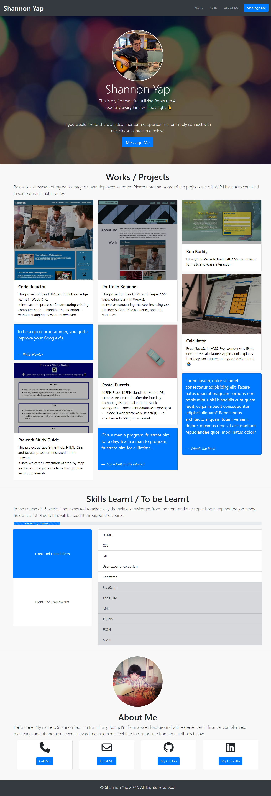

# Week-3 Challenge - Bootstrap Portfolio

## Description

As a review of the materials we learnt in our third week, our **Week 3 Challenge** will test our skills in UX and Advanced CSS by having us create a Bootstrap-powered portfolio page using bootstrap and custom CSS which we can add to as the course progresses.

In this web application, I have applied the following skills:

>01. Bootstrap
>02. CSS variables
>03. Google-fu

## Installation

N/A

## Usage 

Bootstrap-powered Portfolio page:
https://damnsemicolon.github.io/bootstrap-portfolio-shannon/

Screenshot of deployed website:

## Credits

Philip Howley (Instructor) 
Nic Catania (TA) 
Pod-4 mates 
Myself

## License

## Badges

